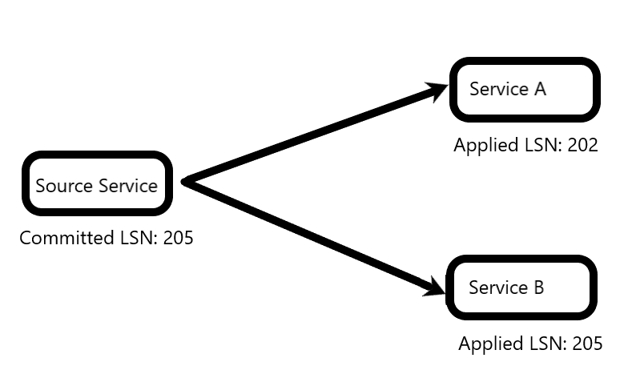
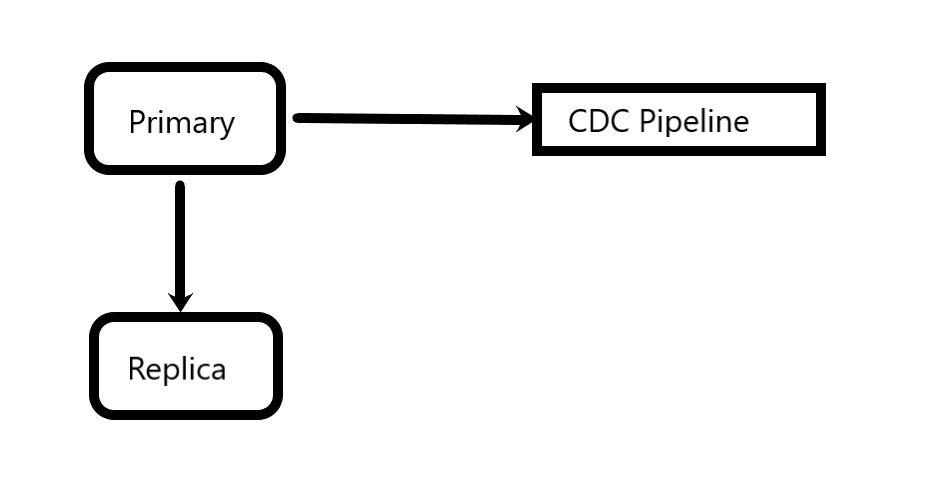
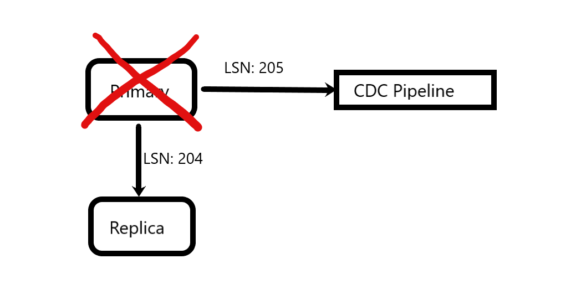
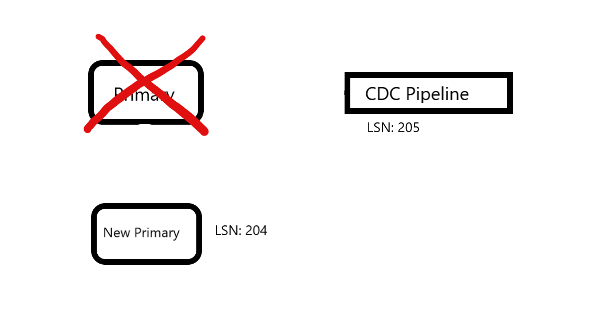

# CDC Caveats

CDC being atomic, doesn't mean services consuming it later gonna also be atomic.
CDC prime feature is its durability in context of committed data will `eventually` got processed.

## You cant get full read-atomic guarantee directly

Consider above image, in which the main source already committed till LSN (Log Sequence Number, i.e. WAL) 205.
2 services consuming from it and calculating different things, one has applied till 202, the other till 205. If there is an API/page/etc that consumes from both services at this time, assuming data read is updated in-between 202 and 205, it means the data read is **NOT** atomic.

To handle this problem, need something a la [RAMP](http://www.bailis.org/papers/ramp-sigmod2014.pdf) or [Facebook's flighttracker](https://research.fb.com/publications/flighttracker-consistency-across-read-optimized-online-stores-at-facebook/)

On smaller case, it may also happens because of single partition guarantee only on CDC storage (e.g. kafka).
If a transaction happen to read data that affects at least 2 partitions, and one of the consumer is lagging behind, it also may results in non-atomicity.

## Naive replication-based is unsafe

Naive replication-based is the one in which the CDC tools directly hook to replication API (e.g. default debezium replication).
The problem is that outside work may be done even if database actually rollbacks it, although can be considered even rarer occurence than typical failure.

Consider a scenario of a typical RDBMS with CDC pipelines. There is a primary, a replica, and CDC that hooks into the primary replications.

Now the primary crashes. It has sent work with LSN 205 to the CDC, but not yet to the replica.

To maintain availability, a HA setup (patroni, pacemaker, manual, etc) now promote replica to primary, which only has till LSN 204 of old master. Now, the CDC already has 205, and consuming services may already do the work, but the primary has no data of it.

The safe way to handle this problem is to use learner-based replication, such as [TiDB's TiFlash](https://pingcap.com/blog/delivering-real-time-analytics-and-true-htap-by-combining-columnstore-and-rowstore#strong-consistency)
